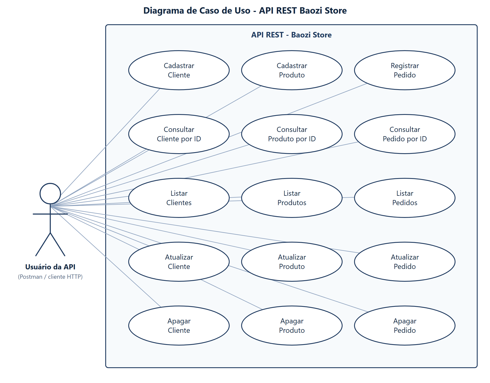

# Baozi Store

A Baozi Store é uma pequena loja que vende pão chinês. Começou com uma receita só, o baozi
de porco, vendido por unidade no balcão.

Conforme a clientela foi crescendo, anotar tudo no caderno deixou de dar conta. Este é o
sistema que resolve isso: um controle simples de quem compra, do que a loja vende e do que
já foi pedido.

## O que ele guarda

**Os clientes**, com o nome e a data em que cada um começou a comprar na loja.

**Os produtos**, com o preço de cada um e se estão disponíveis no momento.

**Os pedidos**, que juntam as duas coisas: quem comprou, o que comprou e quantas unidades
levou.

## O que dá para fazer

De cada um desses cadastros a loja consegue ver a lista completa, procurar um registro
específico, corrigir uma informação errada e apagar o que não serve mais.

---

Trabalho da disciplina de Desenvolvimento Web Back-End.
